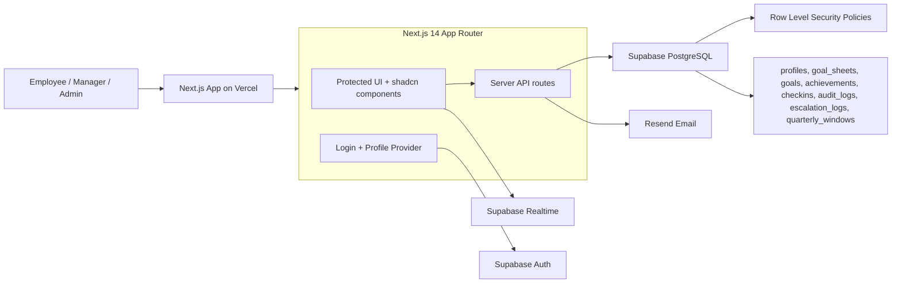

# AtomQuest — Goal Setting & Tracking Portal

AtomQuest is an in-house goal setting, approval, achievement tracking, and governance portal built for Atomberg Technologies' AtomQuest Hackathon 1.0. It packages the full employee, manager, and admin journey into a polished, submission-ready SaaS experience.

## Live Submission

- Live Vercel URL: https://atomquest-portal-beta.vercel.app/
- GitHub repository: https://github.com/ajithh404/atomquest-portal
- Monthly operating cost: $0 using free-tier Vercel, Supabase, and Resend limits.

## Demo Credentials

| Role | Name | Email | Password |
| --- | --- | --- | --- |
| Employee | Rahul Sharma | employee@demo.com | Demo@1234 |
| Manager | Priya Nair | manager@demo.com | Demo@1234 |
| Admin / HR | Admin User | admin@demo.com | Demo@1234 |

## Demo Data Included

The Supabase migration seeds a complete FY2025-26 journey:

- Rahul Sharma reports to Priya Nair.
- Rahul has an approved FY2025-26 goal sheet with goals totaling exactly 100%.
- Rahul's Q1 achievements include sales revenue of 42 against a target of 50, and complaint TAT of 28 hours against a target of 24 hours.
- Priya has pushed a shared safety goal, `Maintain zero safety incidents`, to Rahul's sheet with `is_shared = true` and `shared_from` linked.
- Admin User has an audit log entry for unlocking Goal 2 with reason `Correction requested by HR`.

## Role Descriptions

| Role | What they can do |
| --- | --- |
| Employee | Create goal sheets, add up to 8 goals, balance weightage to 100%, submit for approval, revise returned sheets, log quarterly achievements, and view progress. |
| Manager | Review submitted sheets from direct reports, edit targets before approval, approve or return sheets, push shared goals, and add quarterly check-in comments. |
| Admin / HR | Manage organization structure, configure thrust areas, open or close quarterly windows, unlock approved sheets with audit logging, view reports, and export data. |

## Core Features

- Role-based protected portal for employee, manager, and admin workflows.
- Goal creation, editing, submission, approval, return, and lock behavior.
- Shared goals with recipient-only weightage editing.
- Quarterly achievement windows controlled by admin.
- Progress score calculations for min, max, zero, and timeline UoM types.
- Manager check-ins and comment history per goal.
- Admin reports, completion dashboard, XLSX export, and searchable audit logs.
- Admin escalation console for overdue submissions, stale approvals, missing progress activity, and reminder logs.
- Responsive sidebar, notification bell, and polished AtomQuest login experience.

## Bonus Features

- Realtime notification bell for submitted, approved, returned, check-in, and window-open activity.
- Resend email notifications for approvals, returns, and opened quarterly windows.
- Recharts analytics for progress trends, department completion, thrust-area distribution, and UoM mix.
- SheetJS Excel export with populated achievement data.
- Admin audit trail for governance actions.
- Dark/light dashboard theme with persisted preference.

## Tech Stack

| Layer | Technology |
| --- | --- |
| Framework | Next.js 14.2.35, App Router, TypeScript |
| Styling | Tailwind CSS v3, shadcn/ui new-york style, lucide-react |
| Forms | react-hook-form, zod, @hookform/resolvers |
| Auth + Database | Supabase Auth, PostgreSQL, Row Level Security |
| Realtime | Supabase realtime subscriptions |
| Charts | Recharts |
| Export | SheetJS / xlsx |
| Email | Resend |
| Hosting | Vercel connected to GitHub auto-deploy |

## Architecture



## Validation And Governance Rules

- Total weightage across all goals in one sheet must equal exactly 100%.
- Minimum weightage per goal is 10%.
- Maximum goals per sheet is 8.
- Shared goal recipients can edit only weightage.
- Approved sheets are locked unless an admin unlocks them.
- Achievement entry is allowed only when the selected quarterly window is open.
- Admin unlock actions are written to `audit_logs`.

## Progress Score Formulas

| UoM Type | Formula | Demo Example |
| --- | --- | --- |
| Min, higher is better | `Math.min(actual / target, 1)` | Sales: 42 / 50 = 84% |
| Max, lower is better | `Math.min(target / actual, 1)` | TAT: 24 / 28 = 85.7% |
| Zero, zero is success | `actual === 0 ? 1 : 0` | Safety incidents |
| Timeline | `1` when on or before target date, otherwise prorated by lateness | Certification deadline |

All scores are capped at 100% and are tracking scores, not ratings.

## Local Setup

1. Clone the repository.

```bash
git clone https://github.com/ajithh404/atomquest-portal.git
cd atomquest-portal
```

2. Install dependencies.

```bash
npm install
```

3. Configure environment variables.

```bash
cp .env.local.example .env.local
```

Required variables:

```bash
NEXT_PUBLIC_SUPABASE_URL=
NEXT_PUBLIC_SUPABASE_ANON_KEY=
RESEND_API_KEY=
```

4. Run `supabase/migration.sql` in the Supabase SQL editor.

5. Start the app.

```bash
npm run dev
```

6. Open http://localhost:3000.

## Project Structure

```text
src/app/(auth)/login              Login page
src/app/(protected)/goals         Employee goal sheets
src/app/(protected)/goals/progress Achievement tracking
src/app/(protected)/team          Manager review workflows
src/app/(protected)/team/checkins Manager check-ins
src/app/(protected)/dashboard     Admin dashboard, analytics, reports, audit, escalations
src/app/api                       Server routes for goals, approvals, admin, reports
src/components                    Shared UI, sidebar, goal, check-in, report components
src/lib                           Supabase clients, types, scoring, validations
supabase/migration.sql            Schema, RLS policies, demo users, and seed data
```

## License

Private project built for AtomQuest Hackathon 1.0.
